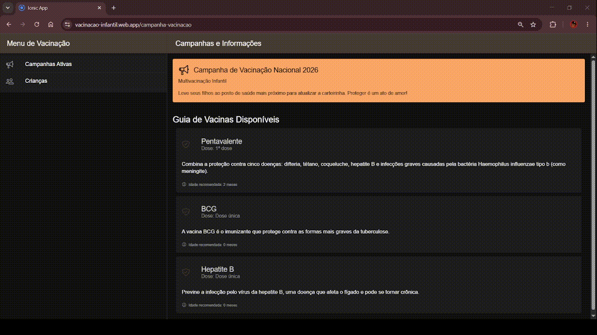

# Carteira de Vacinação Infantil

Aplicativo para gerenciamento de carteira de vacinação de crianças, desenvolvido com **Ionic Framework** e **Angular**, com integração ao **Firebase** como backend.

🚀 **[Acesse o Deploy em Produção](https://vacinacao-infantil.web.app/)**

## 📺 Demonstração Rápida



## Sobre o Projeto

Este é um aplicativo híbrido que permite:

- 📚 **Consultar histórico de vacinação** de crianças cadastradas
- 👶 **Gerenciar dados de crianças** com informações pessoais e de saúde
- 💉 **Visualizar vacinas aplicadas** e acompanhar o calendário de vacinação
- 🎯 **Acompanhar campanhas de vacinação** ativas
- 📱 **Acesso cross-platform** (iOS, Android e Web)

## 🛠️ Tecnologias

- **Frontend Framework**: [Angular 20.3](https://angular.io/)
- **Framework Mobile**: [Ionic 8.0](https://ionicframework.com/)
- **Backend**: [Firebase](https://firebase.google.com/)
  - Firestore (Database)
  - Authentication
- **Linguagem**: [TypeScript](https://www.typescriptlang.org/)
- **Package Manager**: npm
- **Build Tool**: [Capacitor](https://capacitorjs.com/) (para deploy mobile)

## 📦 Dependências Principais

```json
{
  "@angular/core": "20.3.25",
  "@ionic/angular": "8.0.0",
  "@angular/fire": "20.0.1",
  "firebase": "11.10.0",
  "rxjs": "7.8.0"
}
```

## 🏗️ Estrutura do Projeto

```
desafio-tecnico/
├── src/
│   ├── app/
│   │   ├── core/                      # Lógica compartilhada
│   │   │   ├── models/               # Interfaces/Entities
│   │   │   │   ├── crianca.entity.ts
│   │   │   │   ├── vacina.entity.ts
│   │   │   │   └── registro-vacina.entity.ts
│   │   │   └── services/             # Serviços (Firestore integration)
│   │   │       └── carteira-vacinacao.service.ts
│   │   ├── pages/                    # Páginas da aplicação
│   │   │   ├── carteira-vacinacao/   # Histórico de vacinação
│   │   │   ├── criancas/             # Gestão de crianças
│   │   │   └── campanha-vacinacao/   # Campanhas ativas
│   │   ├── tabs/                     # Layout principal com abas
│   │   ├── tab1/, tab2/, tab3/       # Páginas de abas específicas
│   │   ├── app.component.ts          # Componente raiz
│   │   └── app.routes.ts             # Configuração de rotas
│   ├── assets/                       # Ícones e recursos estáticos
│   ├── environments/                 # Configuração por ambiente
│   ├── theme/                        # Estilos globais (SCSS)
│   └── index.html
├── www/                              # Build output (distribuição)
├── public/                           # Assets públicos
├── angular.json                      # Configuração Angular
├── ionic.config.json                 # Configuração Ionic
├── capacitor.config.ts               # Configuração Capacitor
├── tsconfig.json                     # Configuração TypeScript
├── karma.conf.js                     # Configuração de testes
└── package.json                      # Dependências do projeto
```

## 🚀 Como Começar

### Pré-requisitos

- [Node.js](https://nodejs.org/) (v18 ou superior)
- [npm](https://www.npmjs.com/) ou [yarn](https://yarnpkg.com/)
- [Ionic CLI](https://ionicframework.com/docs/intro/cli) (opcional, mas recomendado)
- Firebase Project com credenciais configuradas

### Instalação

1. **Clone o repositório**
   ```bash
   git clone <seu-repositorio>
   cd desafio-tecnico
   ```

2. **Instale as dependências**
   ```bash
   npm install
   ```

3. **Configure variáveis de ambiente**
   - Atualize `src/environments/environment.ts` com suas credenciais Firebase:
   ```typescript
   export const environment = {
     production: false,
     firebaseConfig: {
       apiKey: "YOUR_API_KEY",
       authDomain: "YOUR_AUTH_DOMAIN",
       projectId: "YOUR_PROJECT_ID",
       storageBucket: "YOUR_STORAGE_BUCKET",
       messagingSenderId: "YOUR_MESSAGING_SENDER_ID",
       appId: "YOUR_APP_ID"
     }
   };
   ```

### Desenvolvimento

**Executar servidor de desenvolvimento:**
```bash
npm start
```

O aplicativo estará disponível em `http://localhost:4200/`

**Executar testes:**
```bash
npm test
```

**Linting (ESLint):**
```bash
npm run lint
```

## 🏛️ Arquitetura

O projeto segue a arquitetura **modular e escalável** do Angular:

- **Core Module**: Serviços compartilhados e modelos de dados
- **Services**: Integração com Firestore usando RxJS Observables
- **Components**: Componentes reutilizáveis do Ionic
- **Routing**: Navegação organizada com lazy loading
- **Standalone Components**: Uso de componentes standalone do Angular (padrão moderno)

### Fluxo de Dados

```
Pages (Smart Components)
    ↓
Services (CarteiraVacinacaoService)
    ↓
Firebase/Firestore
    ↓
RxJS Observables
    ↓
UI Updates
```

## 📚 Principais Funcionalidades

### 1. Consultar Crianças
Recupera a lista de todas as crianças cadastradas do Firestore.

### 2. Histórico de Vacinação
Obtém registros de vacinas por criança, combinando dados de:
- `criancas` collection
- `registro-vacina` collection
- `vacinas` collection

### 3. Campanhas de Vacinação
Exibe campanhas de vacinação ativas para a comunidade.

## 🔧 Scripts Disponíveis

| Comando | Descrição |
|---------|-----------|
| `npm start` | Inicia servidor de desenvolvimento |
| `npm run build` | Build para produção |
| `npm run watch` | Build em modo watch |
| `npm test` | Executa testes unitários |
| `npm run lint` | Verifica código com ESLint |
| `ng serve` | Inicia Angular dev server |

## 🔐 Segurança e Configuração

- **Firebase Security Rules**: Configure as regras de segurança no Firestore
- **Environment Files**: Não commit de `environment.prod.ts` com dados sensíveis
- **Authentication**: Implemente autenticação Firebase conforme necessário

**Desenvolvido usando Ionic + Angular + Firebase**